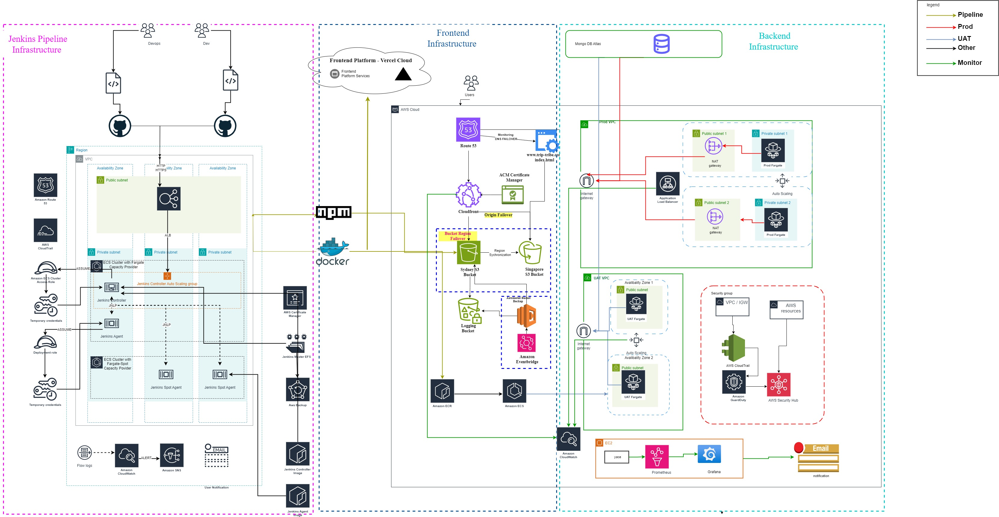

# Project Architecture Overview

Welcome to the project! This document will walk you through the architecture, which is divided into three main parts:
1. Jenkins Pipeline Infrastructure
2. Frontend Infrastructure
3. Backend Infrastructure

The infrastructure design prioritizes high availability, scalability, and rapid disaster recovery for each component. Additionally, monitoring and alerting mechanisms are implemented to ensure automated management of the application.

## Jenkins Pipeline Infrastructure

### Overview
Jenkins pipelines are used for the CI/CD tool. The Jenkins master controller is deployed on AWS ECS Fargate, ensuring automatic disaster recovery. To keep the Jenkins configuration file up to date and available during recovery, AWS EFS is utilized as a centralized network file storage to maintain the Jenkins home folder. This setup ensures that all Jenkins configuration files are readily available for use whenever a new Jenkins controller is brought online.
### Diagram

### Components
- **Jenkins Master Controller**: Deployed on AWS ECS Fargate for automatic disaster recovery.
- **AWS EFS**: Used as a centralized network file storage to maintain the Jenkins home folder.
- **Jenkins Agents**: One Jenkins agent is paired with the Jenkins controller on Fargate for critical tasks. Other Jenkins work nodes are deployed using the Fargate Spot capacity provider, which offers a 70% discount compared to regular Fargate prices.

### Security and Accessibility
- All Jenkins nodes reside within private networks and are exclusively accessible through an AWS Application Load Balancer (ALB).
- A security group is attached to the load balancer, allowing access only to specific IP addresses from team members.
- HTTPS certificates are enabled on the load balancer to guarantee the secure transmission of sensitive data.

### Monitoring and Notifications
- AWS VPC Flow Logs collect all traffic data in the VPC.
- Alarms are triggered through CloudWatch upon detecting predefined filter patterns.
- Notifications are sent to team members via email through Amazon Simple Email Service. Future plans include adding message and voice notifications to diversify notification methods.

## Frontend Infrastructure

### Overview
For deploying the frontend code, two hosting providers are used: Vercel and AWS S3. Vercel is the primary provider due to its native integration with Next.js, which automatically manages scalability, availability, and performance. AWS S3 serves as the backup plan.

### Primary Provider: Vercel
- Vercel cloud platform is chosen for its seamless integration with Next.js and automated management features.

### Backup Plan: AWS S3
- **Primary Destination**: S3 bucket in Sydney.
- **Backup Destination**: S3 bucket in Singapore, synchronized with the Sydney bucket to ensure data consistency.
- **Failover Mechanisms**:
  - **CloudFront Origin Failover**: Redirects requests to the Singapore bucket if a page becomes unavailable in the Sydney bucket.
  - **DNS Failover**: Activates if the entire Sydney bucket is unavailable.
- **Lambda Function**: A Lambda function backs up S3 buckets, triggered through EventBridge on a scheduled basis.

## Backend Infrastructure

### Overview
Two environments are set up for the backend infrastructure: UAT (User Acceptance Testing) and Production. Both environments use AWS EKS Fargate to achieve auto-scaling and load balancing. Environment variables are retrieved from AWS Parameter Store.

### Environments
- **UAT Environment**: Fargate deployed within public subnets.
- **Production Environment**: Fargate resides in private subnets.

### Failover and High Availability
- **Auto Scaling and Load Balancing**: Achieved through AWS EKS Fargate in both environments.
- **Environment Variables**: Retrieved from AWS Parameter Store to ensure consistency and security.

